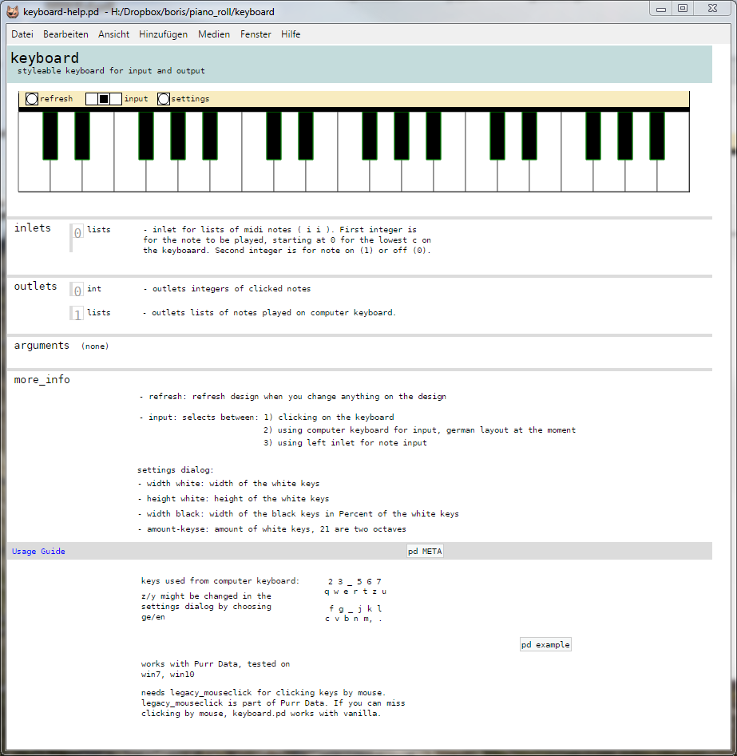
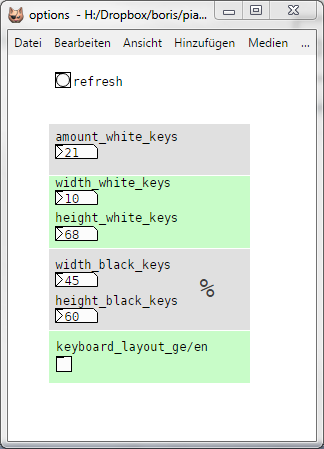

# Pure Data Keyboard

Keyboard for playing notes or visualizing notes.

Amount of keys and their size can be adjusted.

Usage: Download this folder and start keyboard-help.pd

Works with Purr Data out of the box,
If you can miss the ability of clicking on the keys, 
it works with pd vanilla as well

tested on win7/win10
 

