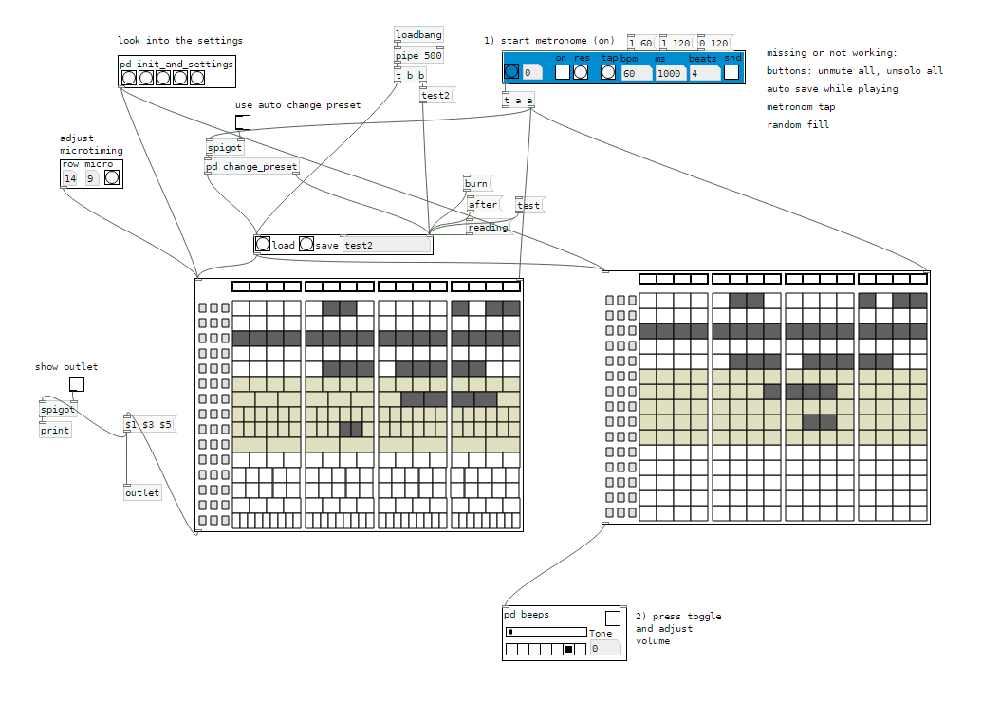

# Pure Data Keyboard

Sequenzer with some special abilities:
- microtiming
- solo and mute buttons
- full length button to get the length till the next note in the row appears
- style, size, amount of beats are fully customizable

Usage: Download this folder and start keyboard-help.pd

Works with Purr Data 2.4.0

tested on win7/win10
 

