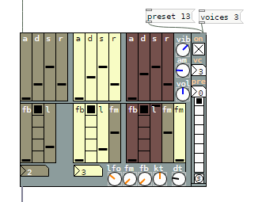

# tri_ops_v2

FM-synth

Reworked version of Martin Brinkmanns tri_ops4p.

http://www.martin-brinkmann.de/indexd.html

https://github.com/coderofsalvation/pd-puredata-vanilla-patches/tree/master/martinbrinkmann/mnb_instruments_wip

New design, restructered code and expanded with the abilities to change amount of voices (0-9) and write/recall presets from the gui.

voices are counted from 0 (0 = one voice)

Works with Purr Data 2.4.9

tested on win7/win10
 

